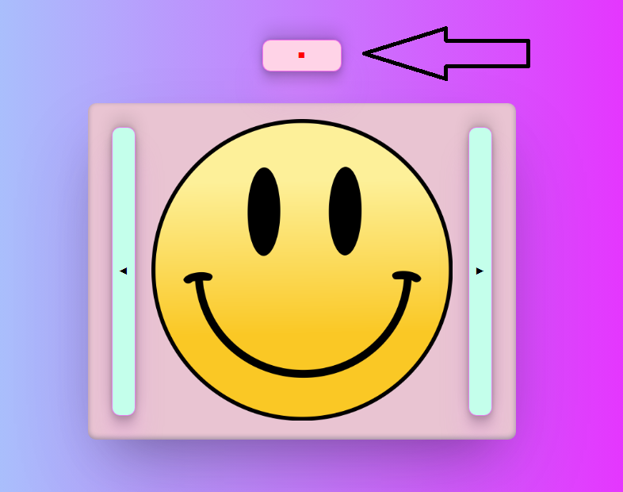

# exove-developer-test
Coding test for Exove's summer trainee program (Fullstack Developer path).

The tasks I completed were 1C, 2A and 3A. The repo is divided in three sections which contain
the directories with the code for each assignment.

# 1C

A simple slider application with React. The slider triggers a change in the squares opacity
after user releases the slider. The value is stored in state and is also displayed in the middle
of the square. To test this application, from the root (1c folder) npm install && npm start

# 2A

A carousel application with React & TypeScript. Automatically rolls the carousel of three smiley pictures.
To test this application, from the root (2a folder) npm install && npm start

.

The application also contains a button which user can use to stop or play the carousel:

# 3A

A program that fetches data from the API (or in this case the github repo) and saves it to SQL Database.
I used Node.js for this.
My solution to handle data with variations was to make separate products out of items that have variations in size.
I also used a library called "translatte" to automate translation process. The data is saved now in three different
languages (fi, en & es). Translatte by default uses Google Translate, so at least in case of finnish the translations
are bit funny, so in a professional case some other library such as DeepL would be better, but with this
no API key is required so it's good enough to demonstrate how I would approach this problem. I used .env to
secure password so that is needed for testing this.
To use this program, from the root (3a folder): npm install && node index.js.
How the data looks like in the database after running the program:

